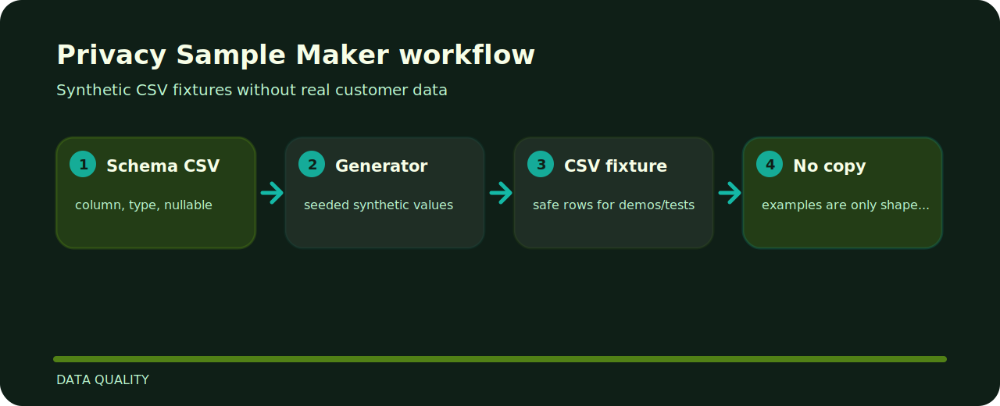

# Privacy Sample Maker


Synthetic CSV fixtures without real customer data. The repo is kept small on purpose: clone it, run the sample, inspect the output, then adapt the idea.

## Local path

```bash
git clone https://github.com/mertefekurt/privacy-sample-maker.git
cd privacy-sample-maker
python -m pip install -e ".[dev]"
privacy-sample-maker examples/schema.csv --rows 5 --seed 11
```

## Where things live

```text
.github/        CI workflow
examples/       sample inputs
src/            package source
tests/          test coverage
.gitignore      project file
pyproject.toml  package metadata
```

## Shape of the tool


